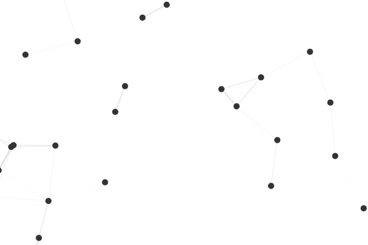

# Dash Particles

[](https://badge.fury.io/py/dash-particles)
[](https://badge.fury.io/js/dash-particles)

A Dash component library that brings interactive particle animation backgrounds to your Dash applications. Built on top of the [tsParticles](https://particles.js.org/) library.

What's the use case? I want to have a nice background for my Dash app for login screens, etc. I like the [particles.js](https://particles.js.org/) library, but I want to use it in Dash. It's a fairly niche use case, but a nice package to have for Dash.

It's not yet the full feature set of [particles.js](https://particles.js.org/), but it's a start, feel free to contribute! I just wanted to get something out there for a project I'm working on.





## Features

- Highly customizable particle animations
- Interactive effects (hover, click)
- Multiple preset configurations
- Responsive design
- Seamless integration with Dash

## Installation

```bash
pip install dash-particles
```

## Basic Usage

```python
import dash
from dash import html
import dash_particles

app = dash.Dash(__name__)

app.layout = html.Div([
    html.H1("My Dash App with Particles"),
    
    dash_particles.DashParticles(
        id="particles",
        options={
            "background": {
                "color": {
                    "value": "#f0f0f0"
                }
            },
            "particles": {
                "color": {
                    "value": "#000000"
                },
                "number": {
                    "value": 50
                },
                "size": {
                    "value": 5
                },
                "links": {
                    "enable": True,
                    "color": "#000000",
                    "opacity": 0.8,
                    "width": 2
                }
            },
            "interactivity": {
                "events": {
                    "onClick": {
                        "enable": True,
                        "mode": "push"
                    },
                    "onHover": {
                        "enable": True,
                        "mode": "repulse"
                    }
                }
            }
        },
        height="400px",
        width="100%"
    )
])

if __name__ == '__main__':
    app.run_server(debug=True)
```

## Component Properties

| Property | Type | Description | Default |
|----------|------|-------------|---------|
| `id` | string | The ID used to identify this component in Dash callbacks | None |
| `options` | object | Configuration options for the particles (see Configuration section) | Default network |
| `height` | string | Height of the particles container (CSS value) | '400px' |
| `width` | string | Width of the particles container (CSS value) | '100%' |
| `className` | string | Additional CSS class for the container div | None |
| `style` | object | Additional inline styles for the container div | {} |
| `particlesLoaded` | boolean | Read-only property indicating if particles have been loaded | False |

## Configuration

The `options` property accepts a configuration object that follows the tsParticles configuration format. Here are the main sections:

### Background

```python
"background": {
    "color": {
        "value": "#f0f0f0"  # Background color
    }
}
```

### Particles

```python
"particles": {
    "color": {
        "value": "#000000"  # Particle color (can be string or array)
    },
    "number": {
        "value": 50  # Number of particles
    },
    "size": {
        "value": 5,  # Particle size
        "random": True  # Random sizes
    },
    "opacity": {
        "value": 0.8,  # Particle opacity
        "random": False  # Random opacity
    },
    "links": {
        "enable": True,  # Enable links between particles
        "color": "#000000",  # Link color
        "opacity": 0.8,  # Link opacity
        "width": 2,  # Link width
        "distance": 150  # Maximum distance for links
    },
    "move": {
        "enable": True,  # Enable particle movement
        "speed": 3,  # Movement speed
        "direction": "none",  # Movement direction
        "random": False,  # Random movement
        "straight": False,  # Straight movement
        "outModes": {
            "default": "bounce"  # Behavior when reaching the edge
        }
    },
    "shape": {
        "type": "circle"  # Particle shape (circle, square, triangle, etc.)
    }
}
```

### Interactivity

```python
"interactivity": {
    "events": {
        "onClick": {
            "enable": True,  # Enable click interactions
            "mode": "push"  # Click effect (push, remove, repulse, bubble)
        },
        "onHover": {
            "enable": True,  # Enable hover interactions
            "mode": "repulse"  # Hover effect (grab, repulse, bubble, connect)
        }
    },
    "modes": {
        "grab": {
            "distance": 200,  # Grab interaction distance
            "links": {
                "opacity": 1  # Link opacity on grab
            }
        },
        "repulse": {
            "distance": 100,  # Repulse distance
            "duration": 0.4  # Repulse duration
        }
    }
}
```

## Preset Configurations

Dash Particles comes with several preset configurations that you can use as a starting point:

### Default Network
```python
dash_particles.DashParticles(
    id="particles",
    options=particle_configs["default"],
    height="400px",
    width="100%"
)
```

### Bubbles
```python
dash_particles.DashParticles(
    id="particles",
    options={
        "background": {
            "color": {
                "value": "#0d47a1"
            }
        },
        "particles": {
            "color": {
                "value": "#ffffff"
            },
            "number": {
                "value": 100
            },
            "size": {
                "value": 10,
                "random": True
            },
            "opacity": {
                "value": 0.7,
                "random": True
            },
            "move": {
                "enable": True,
                "speed": 2,
                "direction": "none",
                "random": True
            },
            "links": {
                "enable": False
            }
        }
    },
    height="400px",
    width="100%"
)
```

### Snow
```python
dash_particles.DashParticles(
    id="particles",
    options={
        "background": {
            "color": {
                "value": "#2c3e50"
            }
        },
        "particles": {
            "color": {
                "value": "#ffffff"
            },
            "number": {
                "value": 200
            },
            "size": {
                "value": 3,
                "random": True
            },
            "opacity": {
                "value": 0.8
            },
            "move": {
                "enable": True,
                "speed": 1,
                "direction": "bottom",
                "straight": False
            },
            "links": {
                "enable": False
            }
        }
    },
    height="400px",
    width="100%"
)
```

## Advanced Usage

### Using as a Background

To use particles as a background for your entire app or a section:

```python
import dash
from dash import html
import dash_particles

app = dash.Dash(__name__)

app.layout = html.Div([
    # Container with relative positioning
    html.Div([
        # Particles as background
        html.Div([
            dash_particles.DashParticles(
                id="particles-bg",
                options={
                    "background": {
                        "color": {
                            "value": "transparent"  # Transparent background
                        }
                    },
                    "particles": {
                        "color": {
                            "value": "#0075FF"
                        },
                        "number": {
                            "value": 80
                        },
                        "links": {
                            "enable": True,
                            "color": "#0075FF",
                            "opacity": 0.5
                        }
                    }
                },
                height="100%",
                width="100%",
            )
        ], style={
            "position": "absolute",
            "top": 0,
            "left": 0,
            "right": 0,
            "bottom": 0,
            "zIndex": 1  # Low z-index to be behind content
        }),
        
        # Content overlay
        html.Div([
            html.H1("My App with Particle Background"),
            html.P("This content appears above the particles")
        ], style={
            "position": "relative",
            "zIndex": 10,  # Higher z-index to be above particles
            "padding": "20px"
        })
    ], style={
        "position": "relative",
        "height": "100vh",
        "overflow": "hidden"
    })
])

if __name__ == '__main__':
    app.run_server(debug=True)
```

### Dynamic Configuration with Callbacks

You can dynamically update the particles configuration using Dash callbacks:

```python
from dash import Input, Output, callback, dcc

app.layout = html.Div([
    dcc.Dropdown(
        id="particle-preset",
        options=[
            {"label": "Default", "value": "default"},
            {"label": "Bubbles", "value": "bubbles"},
            {"label": "Snow", "value": "snow"}
        ],
        value="default"
    ),
    
    html.Div(id="particles-container")
])

@callback(
    Output("particles-container", "children"),
    Input("particle-preset", "value")
)
def update_particles(preset):
    presets = {
        "default": {...},  # Default config
        "bubbles": {...},  # Bubbles config
        "snow": {...}      # Snow config
    }
    
    return dash_particles.DashParticles(
        id="particles",
        options=presets[preset],
        height="400px",
        width="100%"
    )
```

## Browser Compatibility

Dash Particles is compatible with all modern browsers:

- Chrome (latest)
- Firefox (latest)
- Safari (latest)
- Edge (latest)
- Opera (latest)

## Performance Considerations

For optimal performance:

- Limit the number of particles (50-200 is usually sufficient)
- Reduce particle complexity on mobile devices
- Consider disabling interactions on low-end devices

## Contributing

See [CONTRIBUTING.md](./CONTRIBUTING.md) for details on how to contribute to this project.

## License

This project is licensed under the MIT License - see the [LICENSE](./LICENSE) file for details.

## Acknowledgements

- [tsParticles](https://particles.js.org/) - The underlying JavaScript library
- [Dash](https://dash.plotly.com/) - The Python framework for building web applications

## Support

If you encounter any issues or have questions, please [open an issue](https://github.com/yourusername/dash-particles/issues) on GitHub.
